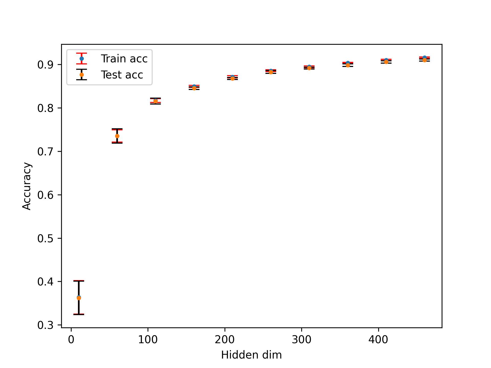

# Extreme Learning Machine (ELM)

Implementation of a Extreme Learning Machine (ELM) for MNIST digit recognition (60k patterns).

### Performance (70/30 split)

#### Resources:

- [Ding, S., Xu, X. & Nie, R. Extreme learning machine and its applications. Neural Comput & Applic 25, 549–556 (2014).](https://doi.org/10.1007/s00521-013-1522-8)